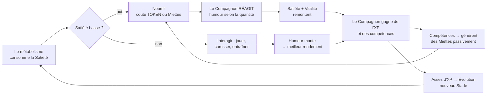

# Tokidachi — Spécification de conception (GDD v0.3)

> *Codename de travail : **Tokidachi** (token + tomodachi, « l'ami-jeton »).*

Document de conception fonctionnelle pour un **jeu de bureau (desktop companion) idle + care**, mêlant les codes du tamagotchi et de l'idle game. Le joueur adopte une créature mignonne (pixel art) qu'il doit **nourrir avec des TOKEN issus de sa subscription**, garder en vie, faire évoluer, et rendre à terme **autosuffisante** via un arbre de compétences.

---

## 1. Vision & pitch

Une petite créature vit sur ton bureau — **uniquement quand ton PC est déverrouillé** (écran verrouillé = elle est gelée, elle ne vieillit ni n'a faim). Elle est adorable, expressive, animée en pixel art. **Elle ne vit que de tokens, et ce sont *tes vrais* tokens** : ceux de ta subscription IA, les mêmes que tu utilises pour toi. Son métabolisme les consomme lentement pendant que tu bosses. Si tu la négliges trop longtemps, elle tombe malade puis meurt — **définitivement**.

> **Le dilemme moral, c'est le jeu.** Chaque token qui nourrit le Compagnon est un token que tu ne dépenses pas pour toi (ton travail, tes prompts). Le Compagnon est littéralement un *concurrent* de ta propre consommation. Le nourrir, c'est choisir de dépenser pour lui. C'est ça, la tension centrale — et c'est ce qui rend l'autosuffisance (§5.1) désirable : la seule façon d'arrêter le conflit, c'est qu'il apprenne à se nourrir seul.

Le twist idle : au lieu de la nourrir éternellement à tes frais, tu lui apprends des **compétences** qui lui font **générer sa propre monnaie in-game**. Une créature bien élevée finit par **payer sa propre nourriture** — elle ne pèse plus sur ton budget de tokens. C'est le cœur de la progression : *passer de « je dois la nourrir » à « elle vit sa vie ».*

**Fantasme du joueur** : « J'ai un petit être vivant qui grandit avec moi, dont je suis responsable, et que j'ai réussi à rendre autonome. »

---

## 2. Glossaire (terminologie de référence)

On fixe le vocabulaire une fois pour toutes ; le reste du doc s'y tient.

| Terme | Définition |
|---|---|
| **Compagnon** | La créature. Instance unique par sauvegarde (multi-compagnons = V3). |
| **TOKEN** (jetons) | Représentation, en jeu, de ta **capacité forfaitaire partagée** (le quota de ta subscription IA). Rare, à valeur réelle : chaque TOKEN dépensé pour le Compagnon est indisponible pour ton propre usage. Consommé par le **nourrissage** (chaque repas déclenche une réaction générée du Compagnon, §6.6). |
| **Miettes** | Monnaie *douce*. Générée par le Compagnon lui-même via ses compétences. Ne touche **pas** ton quota. Gratuite mais lente. |
| **Cerveau local** | Mode d'expression **sans consommer ton quota** : réactions scriptées/locales, ou générées par un provider gratuit / le mode DEV. Permet de profiter du Compagnon sans dépenser ta capacité. |
| **Satiété** | Jauge de faim (0–100). Baisse par le métabolisme. |
| **Vitalité** | Jauge de santé (0–100). Baisse quand la Satiété est à zéro. À 0 prolongé → mort. |
| **Humeur** | Jauge de bonheur (0–100). Influence le rendement des compétences. |
| **Métabolisme** | Consommation passive de la Satiété au fil du temps (le « coût de vivre »). |
| **Stade** | Étape du cycle de vie (Œuf → Adulte → …). Change l'apparence et débloque des mécaniques. |
| **Compétence** | Aptitude apprise dans l'arbre. Réduit les coûts, génère des Miettes, ou débloque des actions. |
| **AIProvider** | Le provider d'IA branché (**pluggable**) : génère les réactions au nourrissage et modélise ta capacité restante. Supporte un **mode DEV** (réactions simulées, zéro conso réelle) et des **tiers gratuits** (ex. Gemini free). |

---

## 3. Boucle de gameplay (core loop)



- **Boucle courte (minutes)** : surveiller la faim, nourrir, jouer, ramasser les Miettes produites.
- **Boucle moyenne (session)** : dépenser TOKEN/Miettes en nourriture, objets, compétences ; entraîner le Compagnon.
- **Boucle longue (jours/semaines)** : faire évoluer le Compagnon de stade en stade, jusqu'à l'autosuffisance puis les formes évoluées rares.

**Tension centrale conçue exprès** : chaque TOKEN dépensé pour nourrir est un TOKEN pris à ton budget réel. L'idle offre l'échappatoire : investir des TOKEN *maintenant* dans des compétences pour ne plus en dépenser *plus tard*. C'est un arbitrage court terme / long terme.

---

## 4. Le Compagnon

### 4.1 Jauges vitales

| Jauge | Plage | Comportement | Conséquence si basse |
|---|---|---|---|
| **Satiété** | 0–100 | Baisse au rythme du Métabolisme | À 0, la Vitalité commence à baisser |
| **Vitalité** | 0–100 | Stable si Satiété > seuil ; baisse si Satiété = 0 ; remonte lentement si bien nourri | À 0 pendant *N* → maladie → mort |
| **Humeur** | 0–100 | Monte avec le jeu/les câlins/les objets ; baisse avec la faim ou l'ennui | Bonus/malus multiplicatif sur la génération de Miettes (ex. ×0,5 à ×1,3) |

> **Ordre de dégradation** (important pour l'UX, pas de mort brutale) : Faim → Baisse d'humeur → Baisse de vitalité → Maladie (état visible, réversible) → Mort. Chaque palier laisse une fenêtre d'action et un signal clair.

### 4.2 États visibles

`Œuf` · `Heureux` · `Neutre` · `Affamé` · `Grognon` · `Malade` · `Endormi` · `En travail` (génère des Miettes) · `Mort` · `Esprit` (post-mort, cf. §8.3).

Chaque état a son sprite + son animation idle. La lisibilité de l'état à l'œil nu (sans ouvrir de menu) est un objectif de design fort — c'est un compagnon de bureau.

### 4.3 Cycle de vie & évolution

| Stade | Débloque | Métabolisme | Note |
|---|---|---|---|
| **Œuf** | — | nul | Éclot après X interactions / temps |
| **Blob (bébé)** | Nourrissage de base | faible | Ne peut pas encore travailler |
| **Enfant** | 1er slot de compétence | moyen | Premières Miettes possibles |
| **Ado** | Boutique complète, mini-jeux | moyen+ | Personnalité qui s'affirme (variations d'humeur) |
| **Adulte** | Arbre de compétences complet | élevé | Peut devenir autosuffisant |
| **Formes évoluées** (V2/V3) | Cosmétiques rares, capacités spéciales | variable | Embranchements selon le style d'élevage (cf. §6.4) |

L'évolution est déclenchée par un **seuil d'XP** + éventuellement une **condition** (ex. « avoir survécu 3 jours sans tomber malade », « avoir appris 2 compétences »). L'apparence change nettement à chaque stade → forte récompense visuelle.

---

## 5. Économie & monnaies

### 5.1 Deux monnaies, une bascule

- **TOKEN** — dur, externe, précieux : **ta capacité forfaitaire partagée**. Drainé par le **nourrissage** (garder le Compagnon en vie). Chaque TOKEN dépensé pour lui, c'est autant en moins pour ton propre travail dans la période. *Le repas déclenche une réaction générée du Compagnon (§6.6) — c'est le charme, pas un coût séparé.*
- **Miettes** — doux, interne, généré. Achète la nourriture courante, les objets, les cosmétiques, les compétences avancées. **Ne touche jamais ton quota.**

**L'intention économique — la bascule vers l'autonomie :**
- Au début tu nourris en TOKEN (ta capacité). Les compétences de Production génèrent des Miettes → un adulte optimisé se nourrit **sans toucher ton quota**.
- Le régime permanent visé : un Compagnon adulte, bien élevé, qui **ne consomme plus ton forfait pour vivre**. Le dilemme du §1 ne mord qu'au début et sur les repas premium — c'est voulu.

> **Jouer sans dépenser ta vraie capacité reste toujours possible** via le **mode DEV** ou un **provider gratuit** (§5.3). Le dilemme forfaitaire est un *choix* que le joueur active en branchant son vrai provider payant, pas une contrainte imposée.

### 5.2 Table des aliments (exemple à équilibrer)

| Aliment | Coût | Satiété rendue | Bonus |
|---|---|---|---|
| Miette rassie | 5 Miettes | +10 | — |
| Croquette | 15 Miettes | +30 | — |
| Repas complet | 40 Miettes | +70 | +5 Humeur |
| Festin premium | 3 TOKEN | +100 | +20 Humeur, +Vitalité |
| Ration d'urgence | 1 TOKEN | +50 instantané | Débloqué même si portefeuille Miettes vide |

> Les valeurs sont des placeholders — le vrai travail d'équilibrage se fera sur un tableur (courbes de coût/rendement, cf. §14).

### 5.3 Le provider d'IA (`AIProvider`) — **DÉCIDÉ : forfait + pluggable + mode DEV**

Le Compagnon fait de **vrais appels IA** uniquement pour **réagir quand on le nourrit** (§6.6) — pas de conversation libre. La source de ces appels (et donc de la « capacité » consommée) est **branchable par le joueur** derrière l'interface `AIProvider`. Trois usages, du plus sûr au plus fidèle au pitch :

1. **Mode DEV** — aucun appel réel : réactions **simulées** (scriptées/locales), zéro consommation. Indispensable pour le développement, et proposé aux joueurs qui ne veulent aucun coût. *Défaut au premier lancement.*
2. **Provider gratuit** — le joueur branche un tier gratuit (ex. **Gemini free tier**, ou un modèle local type Ollama). Le Compagnon parle « pour de vrai » sans que ça coûte d'argent ; le seul « coût » est le rate-limit gratuit. Le dilemme devient léger.
3. **Provider forfaitaire payant** — le joueur branche son vrai provider (le quota qu'il utilise pour son travail). **Là, le dilemme mord vraiment** : chaque réaction du Compagnon grignote la capacité qu'il réservait à lui-même. C'est le pitch dans sa version la plus intense — mais c'est un **choix opt-in**, jamais imposé.

Le **modèle de jeu ne change pas** selon le provider : `AIProvider` fournit une jauge de capacité (réelle ou simulée) et exécute/simule la génération de réaction. Seule la source varie.

> ⚠️ **Réalité technique à cadrer honnêtement** : une subscription forfaitaire *grand public* n'expose en général pas de compteur d'usage aux tiers, et l'utiliser hors de son app officielle peut **violer les CGU**. D'où la conception *bring-your-own-provider* : on privilégie **clé d'API + budget de capacité auto-imposé** (le joueur fixe « X pour la période », suivi localement, sans jamais afficher d'€ — juste une jauge), les **tiers gratuits**, et le **mode DEV**. L'intégration d'une subscription officielle n'est envisagée qu'après vérification CGU/technique.

---

## 6. Mécaniques

### 6.1 Nourrissage, faim & mort

- Le Métabolisme draine la Satiété selon le Stade (courbe croissante avec l'âge).
- Nourrir = choisir un aliment → payer → restaurer Satiété (+Humeur/Vitalité selon aliment).
- **Vit seulement PC déverrouillé** — le métabolisme ne tourne **que pendant que la session est active/déverrouillée**. Écran verrouillé, veille, session fermée → le Compagnon est **gelé** : il ne vieillit pas, n'a pas faim, ne consomme pas de tokens. Sa durée de vie se mesure donc en **temps d'écran actif**, pas en temps calendaire. Conséquence élégante : il ne peut pas mourir pendant la nuit, et sa faim est indexée sur *ta présence* — plus tu bosses (et plus tu utilises tes propres tokens), plus il a faim. La tension du §1 est mécanisée ici.
- **Détection d'état de session** : le jeu écoute les événements verrouillage/déverrouillage de l'OS (cf. §10). Au déverrouillage, un **rapport de retour** résume ce qui a changé pendant la session précédente.
- **Pas de mode vacances nécessaire** : le gel au verrouillage le remplace naturellement.

### 6.2 Compétences (l'arbre)

Chaque compétence occupe un slot (nombre de slots croît avec le Stade). Catégories :

- **Production** : génère des Miettes passivement (cœur de l'autosuffisance).
- **Efficacité** : réduit le Métabolisme ou le coût des aliments.
- **Conversion** : améliore le taux TOKEN → nourriture, ou permet de convertir TOKEN ↔ Miettes.
- **Automatisation** : le Compagnon **s'auto-nourrit** avec ses Miettes quand la Satiété passe sous un seuil (l'aboutissement idle : il vit tout seul).
- **Sociales / cosmétiques** : nouvelles animations, interactions, débloque des mini-jeux.

L'apprentissage coûte des TOKEN (compétences précoces) puis des Miettes (compétences tardives), et prend du **temps d'entraînement** (mécanique idle : le Compagnon « étudie » pendant une durée réelle).

### 6.3 Boutique & objets

- **Nourriture** (cf. §5.2).
- **Jouets** (montent l'Humeur, effet à cooldown).
- **Mobilier / déco** de sa petite chambre (cosmétique + petits bonus passifs).
- **Cosmétiques** (chapeaux, couleurs, accessoires).
- **Livres de compétence** (débloquent des branches de l'arbre).

### 6.4 Évolution dirigée (V2)

Le *style d'élevage* infléchit la forme adulte : beaucoup de jeu → forme « joueuse », beaucoup d'entraînement → forme « savante », beaucoup de nourriture premium → forme « dodue », etc. → **rejouabilité** et attachement.

### 6.5 Mini-jeux (V2)

Petits jeux d'adresse/timing rapportant des Miettes ou de l'Humeur.

### 6.6 Réactions au nourrissage (vraie IA, unidirectionnel)

**Pas de conversation.** Le Compagnon ne se pilote pas au clavier. En revanche, **chaque fois qu'on le nourrit, il réagit** par une courte réplique en caractère, générée par l'`AIProvider` (§5.3). C'est la signature « vivante » du jeu.

- **L'humour dépend de la quantité donnée** — c'est le ressort comique principal :
  - *Repas ridicule* → sarcasme, moue, « c'est tout ? », déception feinte.
  - *Repas normal* → remerciement mignon, réaction contente.
  - *Festin démesuré* → émerveillement, coma alimentaire, « je vais exploser », gratitude exagérée, easter eggs.
- **Modulé par le contexte** : Stade (un bébé babille, un adulte ironise), Humeur, Vitalité, historique récent.
- **Court par conception** : quelques mots à une ou deux phrases.
- **Coût** : la réaction est générée par le provider branché. En **mode DEV** ou avec un **provider gratuit**, elle ne coûte rien de réel.
- **Repli gracieux (Cerveau local)** : si aucun provider n'est branché, si le quota est épuisé, ou en cas d'erreur réseau, le Compagnon **réagit quand même** via des répliques scriptées locales (banque de lignes par tranche de quantité × humeur). Le jeu ne casse jamais faute d'IA.
- **Garde-fou éthique (cf. §12)** : la réaction peut être drôlement déçue quand tu donnes peu, mais **jamais culpabilisante ni manipulatrice**. Vanne ≠ chantage affectif.

> Design tip : mettre en cache/pré-générer une réserve de réactions par catégorie (quantité × humeur × stade) pour lisser la latence et le coût.

---

## 7. Systèmes idle

L'« idle » ici = le Compagnon travaille **en arrière-plan pendant que tu utilises ton PC pour autre chose** (session déverrouillée mais tu n'interagis pas avec lui). Il n'y a **pas** de production « hors-ligne » au sens classique : verrouillé, il est gelé (§6.1).

- **Génération en arrière-plan** : les compétences de Production produisent des Miettes tant que la session est active, même app en fond, **plafonnée** (ex. stock de N heures d'écran max).
- **Rapport de retour** : au déverrouillage / au premier plan, un récap « depuis la dernière session : +X Miettes, l'humeur a baissé, il a un peu faim, il a fini d'apprendre telle compétence ».
- **Calcul par snapshot** : au verrouillage, on enregistre un instantané (timestamp monotone + état) ; au déverrouillage, on rejoue **le temps déverrouillé écoulé** de façon déterministe. Le temps passé verrouillé est ignoré.

---

## 8. Progression, rétention & fin de vie

### 8.1 Progression

XP gagnée par les soins, le jeu, l'entraînement → niveaux → seuils d'évolution. Compétences → puissance économique. Cosmétiques → expression de soi.

### 8.2 Rétention (sans dark pattern agressif — cf. §12)

Notifications douces, stock idle plafonné, événements cosmétiques saisonniers, objectifs longs (formes rares).

### 8.3 Mort & recommencement — **DÉCIDÉ : permadeath**

La mort est **définitive**. Pas de réanimation. On peut ensuite **créer un nouveau Compagnon** (repart de l'Œuf, stats à zéro).

- Le nom, l'apparence et les compétences du Compagnon mort sont perdus → la mort **compte** émotionnellement.
- Un petit **mémorial / cimetière** conserve la trace des anciens Compagnons (nom, âge atteint, date).
- ⚠️ **Sous-décision (optionnelle)** : repart-on de **zéro absolu**, ou un léger **héritage** (bonus de départ transmis, façon roguelite) ? À trancher.

---

## 9. UI / UX & direction artistique

- **Style** : pixel art, palette douce, gros yeux, animations idle expressives. *Cute d'abord.*
- **Fenêtre** : petite fenêtre de bureau, option *always-on-top*. Le Compagnon + ses jauges + boutons rapides.
- **Tray système** : icône d'état qui reflète l'humeur, notifications discrètes.
- **Lisibilité d'état sans clic** : l'humeur/faim doit se lire à l'apparence du sprite.
- **Desktop pet libre** (V3) : le Compagnon se balade sur l'écran façon Shimeji.

---

## 10. Architecture technique — **Flutter écarté, Tauri v2 + PixiJS recommandé**

**Contraintes** : fenêtre transparente/always-on-top/click-through sélectif ; résident permanent (empreinte faible) ; intégration API IA de premier plan ; détection verrouillage session ; pixel art animé fluide.

### Recommandation : **Tauri v2 + PixiJS**
- Coque native légère (webview système). Transparent / borderless / always-on-top natifs. Click-through via `setIgnoreCursorEvents` + boucle de poll curseur.
- **PixiJS** pour le sprite (nearest-neighbor, sprite sheets) ; panneaux en HTML/React.
- Détection lock/unlock via Rust par plateforme (Windows `WM_WTSSESSION_CHANGE`, macOS `com.apple.screenIsLocked` / CGSession, Linux logind/dbus).
- **Coûts connus à valider tôt (spike)** : pas de hit-testing natif par région ; transparence macOS capricieuse (`macOSPrivateApi: true`).

### Alternative : **Electron** (lourd mais batteries incluses) · **Godot 4** (si moteur de jeu prime)

### Stack complet (Tauri)
- **Coque** : Tauri v2 (Rust) — overlay, tray, lock/unlock, auto-update.
- **Rendu pet** : PixiJS. **UI/boutique** : React.
- **Persistance locale** : SQLite (`tauri-plugin-sql`), **offline-first**. *(MVP milestone 1 : `tauri-plugin-store` JSON, migration SQLite quand le ledger arrivera.)*
- **Provider d'IA** : interface `AIProvider` abstraite (§5.3) — pluggable, mode DEV, tiers gratuits.
- **Sync cloud** (V2, optionnel) : Supabase.
- **Anti-triche horloge** : timestamps monotones.

---

## 11. Modèle de données (esquisse)

```
Companion(id, name, stageId, xp, birthAt, lastTickAt, statusEnum)
VitalStats(companionId, satiety, vitality, mood, updatedAt)
Stage(id, code, order, metabolismRate, spriteSet, unlocks)
Skill(id, code, category, effectSpec, costToken, costMiettes, trainSeconds)
SkillProgress(companionId, skillId, state{learning|owned}, startedAt)
Wallet(companionId, tokenBalance, miettesBalance)
LedgerEntry(id, companionId, currency, delta, reason, at)
Item(id, code, type{food|toy|furniture|cosmetic|book}, costCurrency, cost, effectSpec)
Inventory(companionId, itemId, qty)
GameConfig(key, value)
Snapshot(companionId, at, serializedState)
ProviderConfig(id, mode{dev|free|paid}, endpoint, capacityBudget, capacityUsed, periodResetAt)
ReactionLog(id, companionId, feedAmount, currency, mood, text, source{ai|scripted}, at)
```

Économie **data-driven** (courbes et coûts dans `GameConfig`) → équilibrage sans recompilation.

---

## 12. Éthique & honnêteté de conception ⚠️

- Pas de mort par simple absence : le **gel au verrouillage** (§6.1) garantit qu'il ne meurt jamais pendant que tu ne t'en sers pas.
- Une **voie 100 % gratuite** réellement viable : les Miettes doivent permettre de garder le Compagnon en vie sans dépenser un seul token.
- **Transparence totale du coût réel** : jamais de dépense cachée. Le mode payant est **opt-in explicite**.
- **Jouer sans coût réel doit rester pleinement viable** : mode DEV et providers gratuits donnent accès à tout le jeu.
- **La réaction ne manipule jamais** : vanne ≠ chantage affectif.
- Notifications douces, jamais alarmistes.
- Permadeath assumée mais **jamais exploitée pour vendre** : aucune « réanimation payante ».

---

## 13. Points à trancher

**✅ Décidés**
- **Nature de TOKEN** → capacité **forfaitaire** partagée ; provider **pluggable** avec **mode DEV** et **tiers gratuits** (§5.3).
- **Interaction IA** → **pas de conversation** ; réactions au nourrissage uniquement (§6.6).
- **Vie liée à la session** → gelé si verrouillé (§6.1).
- **Mort** → *permadeath* (§8.3).
- **Techno** → *Tauri v2 + PixiJS* ; Electron en fallback ; Godot si moteur de jeu (§10).

**⬜ Restant à trancher**
1. **Providers gratuits à supporter en premier** (Gemini free ? Ollama ?) et forme du « budget de capacité auto-imposé ».
2. **Héritage à la mort** : zéro absolu ou bonus léger transmis ?
3. **Fenêtre contenue vs desktop pet libre** : MVP en fenêtre puis libre en V3 ?
4. **Nom & identité visuelle** du Compagnon.
5. **Multi-compagnons** : jamais / V3 ?
6. **Une seule espèce** ou une gamme de créatures ?

---

## 14. Découpage MVP → V2 → V3

**MVP (jouable, une créature, boucle complète)**
- 1 Compagnon, 3 stades (Œuf → Blob → Enfant) ; **permadeath** + création d'un nouveau.
- Satiété + Vitalité + Humeur.
- **Nourrissage** via `AIProvider` pluggable : **mode DEV par défaut** + au moins un **provider gratuit**, provider payant en opt-in + 2–3 aliments.
- **Réactions au nourrissage** (§6.6) : repli scripté local si pas d'IA.
- Vie liée à la session : **gel au verrouillage**, reprise au déverrouillage + rapport de retour.
- 1 compétence de Production + auto-nourrissage basique.
- Boutique minimale (aliments + 1 jouet).
- Génération en arrière-plan plafonnée.
- Overlay Tauri : fenêtre transparente click-through + tray + notifications douces.

**V2** — Arbre de compétences complet, mini-jeux, cosmétiques & mobilier, évolution dirigée, sync Supabase, stades Ado/Adulte.

**V3** — Desktop pet libre (Shimeji), multi-compagnons / espèces, social, réactions IA enrichies.

---

*GDD v0.3 — décisions verrouillées : forfait + provider pluggable (DEV/gratuit/payant), réactions au nourrissage (pas de chat), vie liée au déverrouillage, permadeath, stack Tauri. Document vivant, à itérer.*
